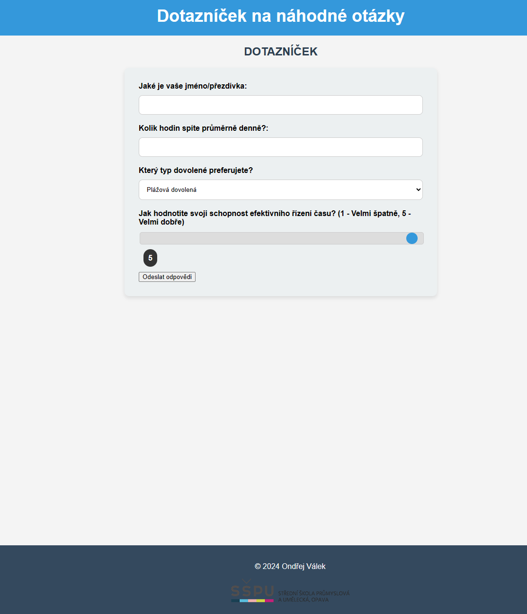
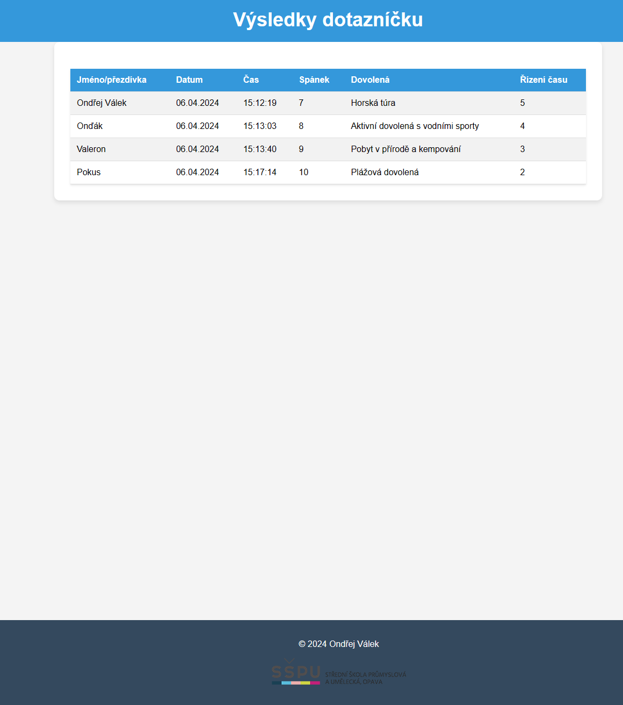

#  Dotaznicek-node
Webová stránka udělána v node.js pomocí JS, CSS a EJS. Stránka se ptá na otázky a vypisuje je   

## Ukázka stránky  

## Jak si to zpustit doma  

### Clonování stránky  

~~~bash  
git clone https://github.com/OndraValek/dotaznicek-node.git
~~~

### Dostaňte se do adresáře   

~~~bash  
cd dotaznicek-node
~~~

### Instalace npm  

~~~bash  
npm install
~~~

### Zapnutí serveru  

~~~bash  
node .
~~~
